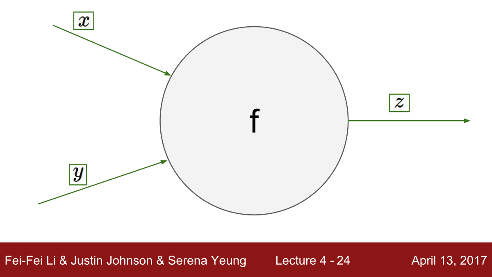
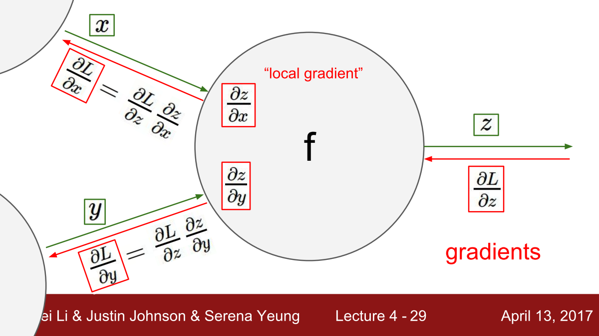

ⓒ JMC 2017

+ [CS231N Video - Playlist](https://www.youtube.com/playlist?list=PL3FW7Lu3i5JvHM8ljYj-zLfQRF3EO8sYv)  
+ [CS231N Notes - Backpropgation](http://cs231n.github.io/optimization-2/)

---

## Backpropagation

### I. Introduction

**Problem statement**:

우리가 풀어야 할 문제는 함수 $f(x)$에서 input $x$가 함수값 $f$에 미치는 영향을 구하는 것이다.
함수값에 대한 변수의 영향력을 gradient라고 하며 $\triangledown f(x)$라고 표기한다.

+ function: $f(x)$
+ input: $x$
+ gradient of $f$ at $x$: $\triangledown f(x)$

**Motivation**:

성능이 뛰어난 Neural Network 모델을 만들려면 loss를 최소화하는 parameter를 구해야 한다.
parameter를 어떻게 변화시켜야 loss가 줄어들까.
parameter값이 loss function에 미치는 영향(=변화율)인 gradient를 구하면 해결할 수 있다.

+ function: $f(x) = L$(loss function)
+ input: $x$  
  1. training data: $(x_i, y_i)$
  2. weights: $W, b$
+ gradient:
  1. gradient of $f$ at training data $(x_i, y_i)$ = $\triangledown L(x_i, y_i)$
  2. gradient of $f$ at weights $(W, b)$ = $\triangledown L(W, b)$

### II. Simple expression and interpretation of the gradient

**Gradient = partial derivative**:

+ function : $f(x, y) = xy$
+ input : $x, y$
+ gradient:
  1. gradient of $f$ at $x$ = partial derivative for $x$ = $y$
  2. gradient of $f$ at $y$ = partial derivative for $y$ = $x$
+ gradient:
  + $\triangledown f$ = vector of partial derivatives
  + $\triangledown f$ = $[\frac{\partial f}{\partial x}, \frac{\partial f}{\partial y}]$
  + $\triangledown f$ = $[y, x]$

**Interpretation**:

+ derivative 의미 : 특정 변수가 함수값에 미치는 영향(=변화율)
+ $f(x+h)=f(x)+h\frac{df(x)}{dx}$

> **Tells**: $x$가 $h$만큼 증가하면, $f$값은 "$x$의 gradient 값$ \times h = h\frac{df(x)}{dx}$"만큼 증가한다.

**Example**:

(1) Multiplication

+ $f(x,y) = xy = -12$
+ $x = 4, y=-3$
+ gradient on $x$ (=partial derivative on $x$) : $\frac{\partial f}{\partial x} = y = -3$
+ gradient on $y$ (=partial derivative on $y$) : $\frac{\partial f}{\partial y} = x = 4$

> **Tells**: $x$값이 $h$만큼 증가하면, $f$값은 "$x$의 gradient 값$ \times h = h\frac{df(x)}{dx}=hy=-3h$"만큼 감소한다. $y$값이 $h$만큼 증가하면, $f$값은 "$y$의 gradient 값$ \times h = h\frac{df(y)}{dy}=hx=4h$"만큼 증가한다.

(2) Addition

+ $f(x,y)=x+y$
+ gradient on $x$ : $\frac{\partial f}{\partial x} = 1$
+ gradient on $y$ (=partial derivative on $y$) : $\frac{\partial f}{\partial y} = 1$

> **Tells**: $x$값이 $h$만큼 증가하면, $f$값은 "$x$의 gradient 값$ \times h = h\frac{df(x)}{dx}=h$"만큼 (1:1비율로) 증가한다. $y$값이 $h$만큼 증가하면, $f$값은 "$y$의 gradient 값$ \times h = h\frac{df(y)}{dy}=h$"만큼 (1:1비율로) 증가한다.

(3) Max

+ $f(x,y)=max(x,y)$
+ gradient on $x$
  + if, $x \ge y \Rightarrow \frac{\partial f}{\partial x} = 1$
  + if, $x < y \Rightarrow \frac{\partial f}{\partial x} = 0$
+ gradient on $y$
  + if, $y \ge x \Rightarrow \frac{\partial f}{\partial y} = 1$
  + if, $y < x \Rightarrow \frac{\partial f}{\partial y} = 0$
+ gradient $\triangledown f= \left[\frac{\partial f}{\partial x}, \frac{\partial f}{\partial y}\right]$

> **Tells**: 더 큰 input값의 gradient는 1이다. input이 $h$만큼 증가하면, $f$값은 "input의 gradient 값$ \times h = h\frac{df(input)}{dinput}=h$"만큼 (1:1비율로) 증가한다.

> **Tells**: 더 작은 input값의 gradient는 0이다.
input값이 $h$만큼 증가하면, $f$값은 "input의 gradient 값$ \times h = h\frac{df(input)}{dinput}=0$"만큼 증가한다. 즉, input값의 변화는 $f$값에 아무런 영향을 미치지 않는다.


### III. Compound expressions with chain rule

**Complicated expressions**:

+ function : $f(x, y, z) = (x+y)z$
+ gradient
  1. $\frac{df}{dx}$
  2. $\frac{df}{dy}$
  3. $\frac{df}{dz}$

**Break down into multiplication**:

+ $f = (x+y)z$
+ $q = x + y$
+ $f = qz$

**Compute derivatives separately**:

+ $f = qz$
  + $\frac{\partial f}{\partial q} = z$ : chain의 연결고리로 사용된다.
  + $\frac{\partial f}{\partial z} = q$ : gradient 3.
+ $q = x + y$
  + $\frac{\partial q}{\partial x} = 1$ : chain의 연결고리로 사용된다.
  + $\frac{\partial q}{\partial y} = 1$ : chain의 연결고리로 사용된다.

**Gradient 1 & 2**:

+ gradient 1 : $\frac{df}{dx} = \frac{\partial f}{\partial q} \cdot \frac{\partial q}{\partial x}$
+ gradient 2 : $\frac{df}{dy} = \frac{\partial f}{\partial q} \cdot \frac{\partial q}{\partial y}$

**Example code**:

```python
# set some inputs
x = -2; y = 5; z = -4;

# perform the forward pass
q = x + y  # q becomes 3
f = q * z  # f becomes -12

# perform the backward pass (backpropagation) in reverse order:
# first backprop through f = q * z
dfdz = q  # df/dz = q, so gradient on z becomes 3
dfdq = z  # df/dq = z, so gradient on q becomes -4

# dqdx and dqdy
dqdx = 1.0
dqdy = 1.0

# now backprop through q = x + y
dfdx = dfdq * dqdx  # dfdx = 1.0. This multiplication here is the chain rule!
dfdy = dfdq * dqdy  # dfdy = 1.0

print("dfdx: %d \ndfdy: %d \ndfdz: %d" %(dfdx, dfdy, dfdz))
```

### IV. Intuitive understanding of backpropagation



**Local**:

전체 graph와 별개로 개별 연산 node에서 output과 local gradient를 구한다.

+ (1) compute output : $f(x, y) = z$
+ (2) compute local gradient of its output at its inputs: $\left[\frac{\partial z}{\partial x}, \frac{\partial z}{\partial y}\right]$

> **Note**: local gradient = gradient of its output at its inputs

**One forward pass, One backward pass**

forward pass가 앞으로 한 번 발생하면 개별 연산 node에 input이 들어가고 전체 graph의 final output이 나온다.
이때 backward pass로 뒤로 거슬러 올 때 local에서 구한 local gradient와 final output의 gradient를 chain하면 개별 연산 node의 input에 대한 final output의 gradient를 구할 수 있다.

+ (3) compute gradient of final output at its output: $\frac{\partial L}{\partial z}$
+ (4) chain gradients: gradient $\times$ local gradient
  + $= \left[\frac{\partial L}{\partial z} \times \frac{\partial z}{\partial x}, \frac{\partial L}{\partial z} \times \frac{\partial z}{\partial y}\right]$
  + $= \left[\frac{\partial L}{\partial x}, \frac{\partial L}{\partial y}\right]$

> **Note**: (4) gradient = gradient of final output its inputs = (2) $\times$ (3)



### V. Modularity: Sigmoid example

`@@@resume`

---


---
