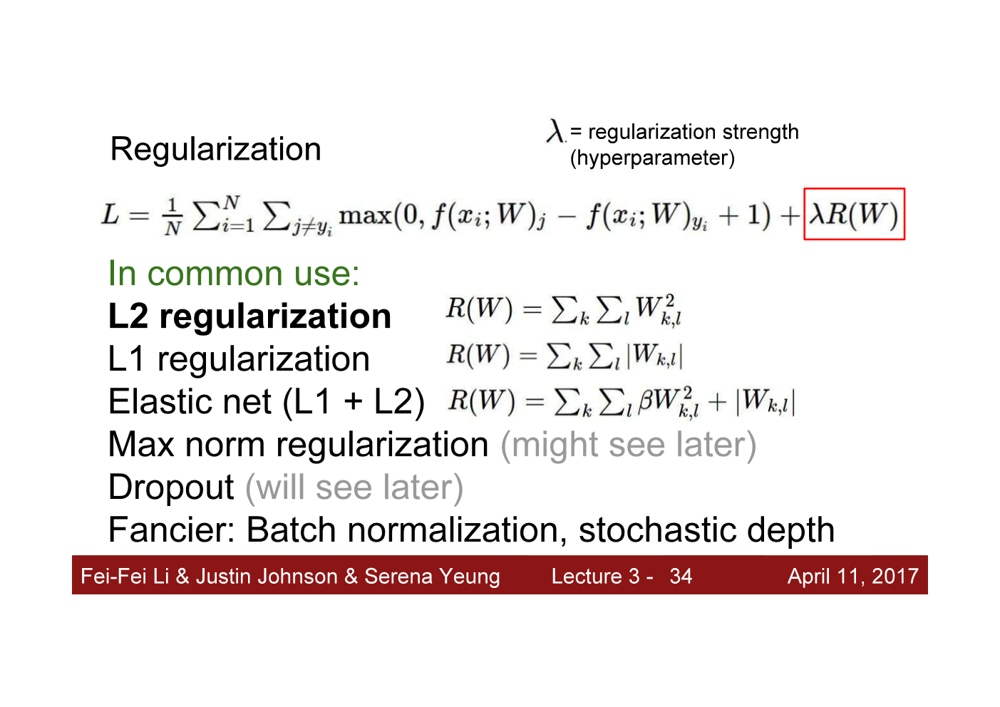
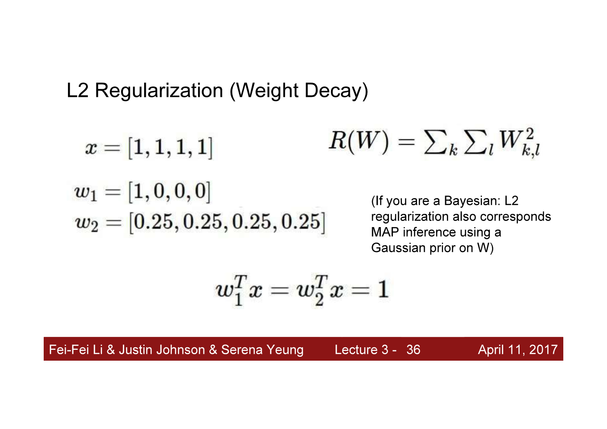
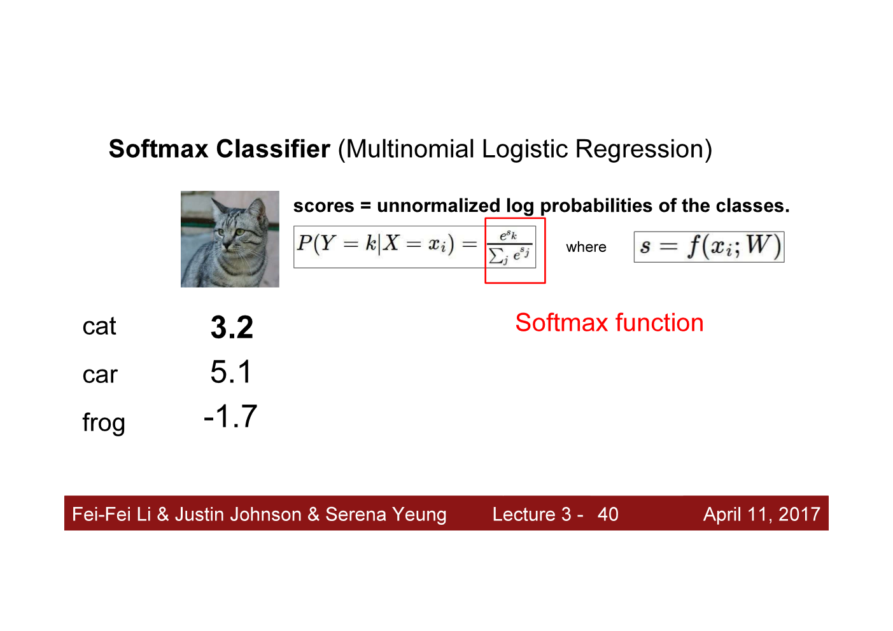
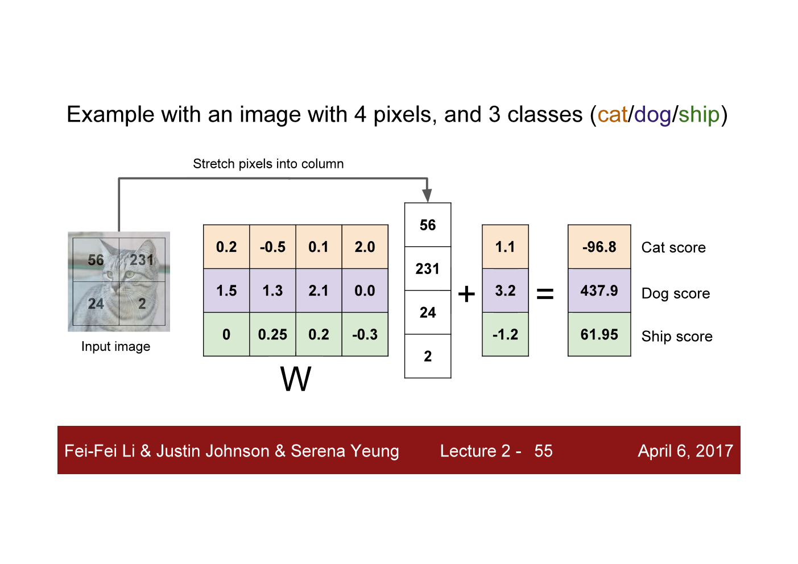
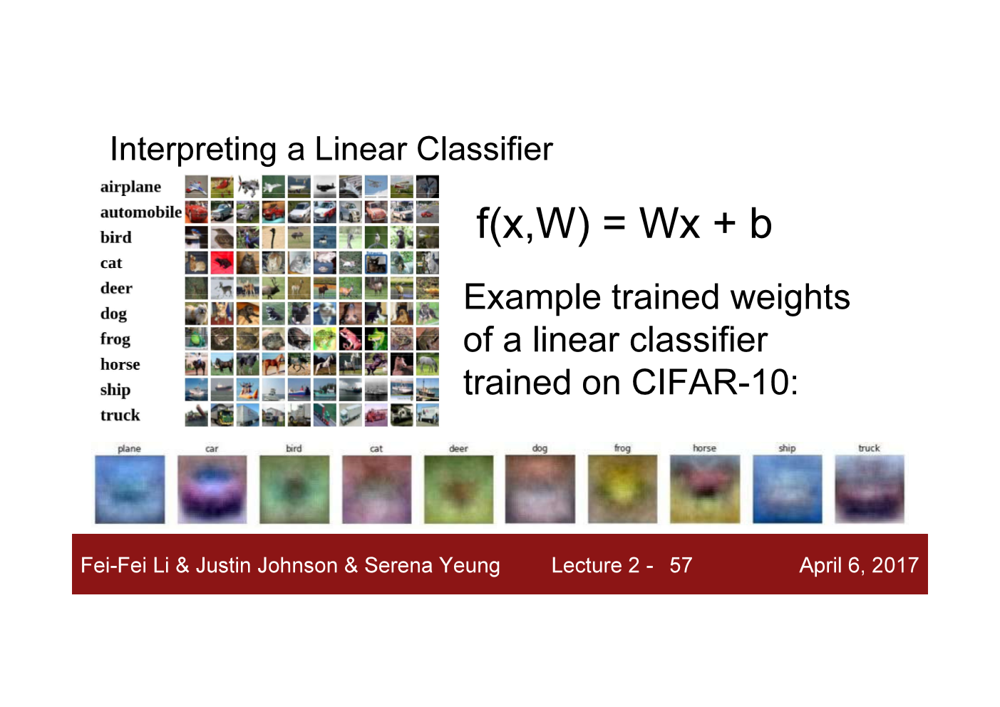
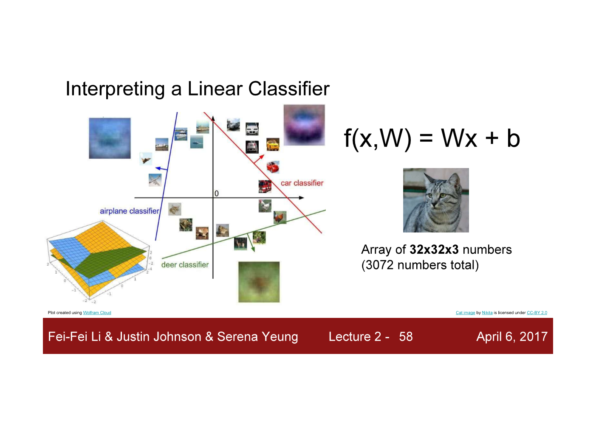
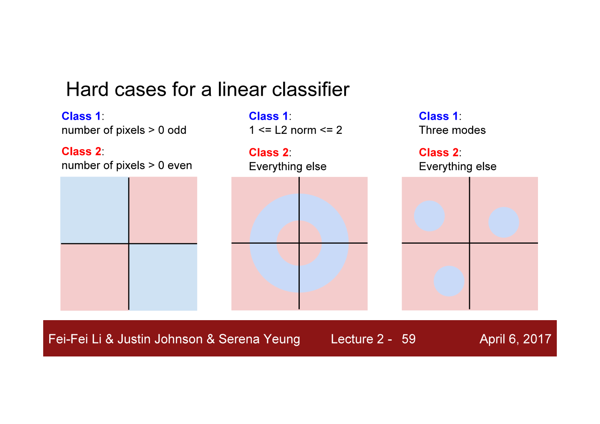

ⓒ JMC 2017

[CS231n_2017 (YouTube)](https://www.youtube.com/playlist?list=PL3FW7Lu3i5JvHM8ljYj-zLfQRF3EO8sYv)

---

## L03 Loss Functions and Optimization

### 1) Loss

loss란 우리가 만든 classifier가 얼마나 틀렸는지를 측정하는 개념이다.
loss 값은 loss function 공식을 정의해서 구한다.
이때 loss function으로 여러 가지 공식을 사용할 수 있다.
중요한 점은 공식에 따라 loss를 다르게 측정한다는 것이다.
classifier가 저지르는 실수가 여러 종류라면, 문제의 특성에 따라 더 조심해야 하는 실수가 있을 수 있다.
예를 들어, 유죄인 사람을 무죄로 잘못 판결내리는 것도 나쁜 실수이지만 무죄인 사람을 유죄로 판결내리는 것은 훨씬 더 나쁜 실수이다.
이런 식으로 용납할 수 없는 실수 A가 발생하지 않도록 하려면 실수 A가 발생할 때마다 더 큰 벌을 줘야 한다.
예를 들어, loss 값에 제곱을 취하면 큰 실수에는 더 큰 벌을 내린다는 뜻이다.

### 2) Regularization

regularization은 모델이 복잡할수록 loss가 커지게 만들어서 training data에 너무 노골적으로 fitting되는 것을 방지하는 개념이다. 즉, 모델의 복잡도에 penalty를 부여하는 것이다.

만약에 loss function을 정의할 때 classifier에게 training data에 fit하는 것에만 신경쓰도록 한다면, classifier는 모든 training data에 완벽하게 맞추려고 할 것이다.
그렇게 되면 위 그림처럼 구불구불한 파란색 curve를 갖게 될 것이다.
이건 좋지 않다. 왜냐하면 우리는 training data가 아니라 test data에 신경써야 하기 때문이다.
만약에 test data가 녹색 네모처럼 들어온다면, 구불구불한 파란색 curve를 가진 classifier는 test data를 완전히 틀리게 예측할 것이다.
차라리 classifer가 녹색의 straight line처럼 예측하도록 만드는 게 더 낫다.
이러한 문제는 기계학습에서 핵심적이고 근본적인 문제이다.

training data에 overfitting 되는 것을 해결하기 위해 regularization이라는 개념을 사용한다.
loss function L(W)에 data loss term을 추가해서 training data에 fit하게 만들뿐만 아니라, regularization term을 추가한다.
regularization term은 model이 더 간단한 W를 선택하도록 유도한다.
parameter W는 왜 간단할수록 좋을까?
과학적 발견에서 쓰이는 핵심적인 아이디어인 Occam's Razor에 따르면,
"만약 관찰 데이터를 설명할 수 있는 모델이 여러 개 있다면, 더 간단한 모델을 선택해야 한다."
왜냐하면 간단한 모델일수록 아직 나타나지 않은 새로운 데이터에 대해 일반화를 잘할 가능성이 더 높기 때문이다.
기계학습에서 regularization 연산을 하는 방식은 regularization penalty를 주는 것이다.
수식에서는 R로 표현한다.

그림과 같이 표준적인 loss function은 data loss와 regularization loss 이렇게 2가지 term을 포함한다.
regularization term에 있는 lambda는 hyperparameter인데, data loss와 regularization loss의 trade-off를 의미한다.
lambda는 모델을 tuning할 때 중요한 영향을 끼치는 hyperparameter이다.

### 3) Different types of Regularization

가장 많이 사용되는 regularization은 L2이다.
L2는 weight decay라고 부르기도 한다.

+ L2 : weight vector W에 대한 Euclidean-norm(=L2-norm)으로 penalize한다.
  + 벡터 W의 원소들이 값이 비슷한 spreaded out W를 선호한다.
+ L1 : weight vector W에 대한 L1-norm으로 penalize한다.
  + L1 regularization은 matrix W의 값이 희박한 sparse W를 선호한다.

> **Note:** norm : 벡터의 길이

### 4) meaning of L1 and L2 Regularization

#### (1) L2 regularization

L2 regularization이 모델의 복잡도를 어떻게 낮추는지 예시를 살펴보자.
우리가 linear classification을 하면 x와 W를 내적(dot product)하게 된다.
linear classification 관점에서 보면, 그림에 있는 w1이나 w2나 x와 dot product하면 값이 1이 되므로 같은 결과를 만들어낸다.
L2 regularization을 하면 w1과 w2 중에 어느 것을 선택하게 될까?
L2는 w2를 선택하게 된다.
왜냐하면 w2가 벡터의 길이, 즉 norm이 더 작기 때문이다.

linear classification에서 W는 벡터 x의 값이 output class와 얼마나 유사한지 측정해주는지 알려주는 기능을 했었다.
따라서 L2 regularization의 의미는 벡터 x에 있는 모든 값이 영향을 골고루 미치도록 하는 W를 선호한다는 뜻과 같다.
벡터 x의 특정 element에만 의존하지 않도록 만들기 때문이다.

#### (2) L1 regularization

L1 regularization은 L2 regularization과 의미가 반대이다.
L1 regularization을 사용하면 w2보다 w1을 선호하게 된다.
왜냐하면 L1 regularization은 벡터 w에 zero 값이 많을수록 모델의 복잡도가 더 낮다고 판단하기 때문이다.
즉 L1은 가급적 벡터 w의 원소 값이 0이 많은 sparse solution을 선호한다.

결국 L2와 L1을 언제 선택해야 하는지는 해결하고자 하는 문제와 데이터에 달려 있다 (problem and data dependent).

### 5) Softmax classifier

multi-class SVM의 모델 `f(x,W)`이 뱉어내는 각 class에 대한 score 값은 input이 어떤 class에 가까운지 알려준다.
그리고 score 값은 loss function에 입력되어서 모델의 정확도를 높이는 데 사용된다.
true class에 대한 score가 incorrect class에 대한 score보다 높으면 좋은 모델로 삼도록 loss function을 정의할 수 있기 때문이다.
하지만 score 값 자체가 어떤 의미인지는 알 수 없었다.
가령, class cat에 대한 score가 3.2이고 class car에 대한 score가 5.1이라면 input이 car에 속할 가능성이 더 높다는 것은 알겠지만 3.2나 5.1이 가지는 의미가 무엇인지는 해석할 수가 없다.

그러나 multinomial logistic regression에서는 score에 확률이라는 의미를 더한다.
score 값을 각 class에 대한 probability distribution을 계산하기 위해 사용하면 된다.
각 score 값을 exponentiate해서 양의 값으로 만든다.
그리고 각 exponent를 모든 exponent의 합으로 나눠준다.
이를 softmax function이라고 부른다.

`#inProgress : https://youtu.be/h7iBpEHGVNc?t=39m47s`

---

## L02 Image Classification

### 1) K-NN?

분류 classification이란 데이터가 어느 클래스에 속하는지 구분하는 문제이다.
input 데이터와 label로 training을 한 다음 test data의 label을 예측한다.
label을 분류하는 알고리즘으로 K-NN을 사용해보면 어떨까?
K-NN은 input 데이터 포인트로부터 distance가 가장 근접한 점 K개 중에서 class가 더 많은 쪽으로 input 데이터를 분류하는 알고리즘이다.
K-NN을 사용할 때 연구자는 k값은 몇으로 할지, distance는 어떤 기준으로 할지 문제상황마다 다르게 적용해야 한다.
이렇게 연구자가 정해야 하는 값을 hyperparameter라고 한다.
hyperparameter는 validation set을 사용해서 최선의 결과가 나오는 것을 선택한다.
그런데 이미지 분류 작업을 할 때는 K-NN을 전혀 사용하지 않는다.
training data가 N개라고 해보자.
test data 1개를 prediction하려면 test data마다 가장 근접한 점 K개를 알아내기 위해 test data와 training data N개와의 거리를 일일이 계산해야 한다.
즉 1) prediction 속도가 너무 느리다.
또한 2) 픽셀 값끼리 계산한 distance는 딱히 의미가 없어서 infomative 하지 않기 때문에 사용하지 않는다.

### 2) linear classification

이미지를 분류하기 위해 parameteric model을 사용할 수 있다.
모든 training data의 정보를 모델의 parameter가 잘 담고 있으면, 한 번 만들어 놓은 모델로 아주 빠르게 prediction을 할 수 있다.
parameteric model로 linear classifier가 있다.
input 데이터 `x`와 parameter `W`를 linear하게 결합하는 것이 linear classifier이다.
수식으로 나타내면 다음과 같다. `f(x,W) = Wx + b`
여기서 `W`는 weight를 나타내는 term으로서 input 데이터와 곱해져서 input 데이터의 정보를 담고 있는 값이다.
가령, `W`가 1이면 모든 곱해지는 값을 그대로 담을 수 있다.
`b`는 bias term으로서 training data가 특정 class에 집중되었을 경우 특정 class에 더 높은 vote 값이 나오도록 하는 값이다.
예를 들어, training 데이터를 구성하는 cat : dog : ship 이미지의 비율이 6:2:2라면, 당연히 모델은 cat을 더 많이 예측하도록 보정해야 한다.

### 3) Example of linear classification

linear model `f(x) = Wx+b`를 input 데이터에 적용하려면 input 데이터와 parameter의 shape(=차원)를 정확히 파악해야 한다.
위 그림에서 input 이미지 `x`는 2 by 2 이미지이므로 flatten 하면 (4, 1)이 된다.
`W` matrix는 input 이미지 모든 픽셀 수만큼 곱해줘야하므로 (?, 4)가 된다.
`W` matrix의 row 수는 label을 구성하는 class 개수를 뜻하고 여기서는 cat, dog, ship 3종류만 있으므로 `W`의 shape는 (3, 4)가 된다.
벡터 `b` 또한 각 class 개수만큼 필요하므로 (3, 1)이 된다.

`W`의 개별 값들은 input image의 각 픽셀이 특정 class에 얼마나 영향을 미치는지 말해준다.
행 단위로 보면 `W` matrix의 각 행은 특정 class를 찾아내는 filter인 셈이다.
가령, 살구색 첫 번째 행은 cat에 대한 유사성(similarity) 점수를, 보라색 두 번째 행은 dog에 대한 유사성 점수를, 녹색 세 번째 행은 ship에 대한 유사성 점수를 매긴다.
`W*x`의 값을 구한 후에는 training data의 bias를 더해서 각 class에 대한 vote 값을 구한다.

### 4) linear classifier as template matching

linear classification을 template matching의 관점에서 볼 수 있다.
`W`의 행은 특정 class를 찾아내는 filter이므로 행을 구성하는 값을 픽셀 값으로 생각해서 하나의 이미지로 시각화할 수 있다.
이를 template 이미지라고 한다.
즉, `W`의 각 행은 특정 class에 해당하는 linear classifier이자 동시에 이미지 관점에서 보면 template 이미지를 의미한다.

학습된 template 이미지를 보면 linear classifier가 training data를 이해하기 위해 뭘 하려고 하는지 알 수 있다.
위 그림은 linear classifer가 모든 training data를 train한 이후이다.
아래에 나온 template 이미지는 학습된 w matrix에서 10개의 class에 해당하는 각 row를 이미지로 시각화한 것이다.
plane에 대한 template을 보면 가운데에 파란색 얼룩 같은 게 있고 파란색 배경을 갖고 있다.
즉 plane에 대한 linear classifier는 파란색이나 파란색 얼룩을 찾아서 plane과의 유사성 점수를 매긴다.
그런데 plane에 대한 template 이미지가 실제로 비행기처럼 생기지는 않았다.
왜 그럴까?
`W` matrix의 각 row는 오직 하나의 class에만 일대일 대응된다.
바꿔 말하면, linear classifier는 각 class마다 하나의 template만 학습하도록 허용된다.
그런데 생각해보면 같은 class의 이미지라도 생김새가 완전히 똑같을 수 없다.
가령, 비행기 머리의 방향이 다를 수도 있고 색이나 배경이 다를 수도 있다.
linear classifier 입장에서 보면, 특정 class에 해당하는 training 이미지의 모습들은 variation이 있을 수밖에 없고, classifier는 각 class마다 하나의 template만 학습하도록 허용되기 때문에 variation을 평균화시켜야만 한다.
요약하면 template이 나타내는 그림은 varation이 평균화된 class의 이미지라서 실제 class의 이미지와 상이한 것이다.

앞으로 배우게 될 neural network나 더 복잡한 모델에서는 하나의 class에 여러 개의 tempate을 학습시켜서 더 높은 정확도를 보인다.

### 5) linear classifier on high dimensional space

linear classifier가 training data를 이해하기 위해 무엇을 하는지 template matching이 아니라 high dimensional space의 관점으로도 확인할 수 있다. space의 차원은 input image의 픽셀 수와 일치한다.

input 이미지를 high dimension space에서 하나의 포인트로 나타낼 수 있다.
이 공간에서 linear classifier는 linear decision boundaries를 그어서, 한 class가 나머지 다른 class와 linear separtion 되도록 분리하는 역할을 한다.

### 6) linear classifier, when to fail

linear classification은 위와 같은 3가지 case에 대응하지 못한다.
가장 오른쪽에 있는 상황은 하나의 class가 다른 공간에서 나타날 때이다.

그럼에도 불구하고, linear classification은 매우 간단하며 해석하기도 쉽고 이해하기 수월한 알고리즘이다.

---

---
