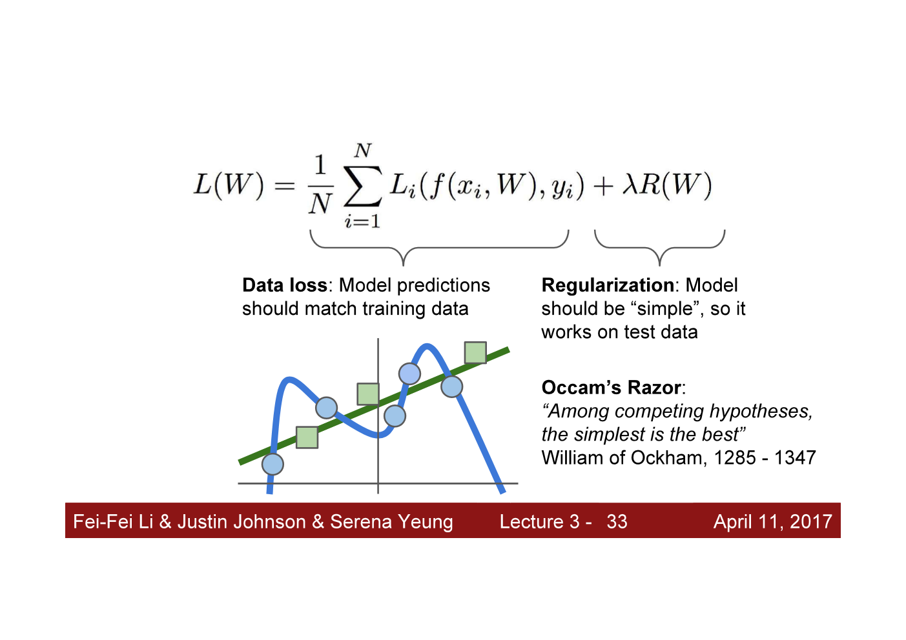

ⓒ JMC 2017

[CS231n_2017 (YouTube)](https://www.youtube.com/playlist?list=PL3FW7Lu3i5JvHM8ljYj-zLfQRF3EO8sYv)

---

## Terms

+ Loss : 모델에 포함된 파라미터의 나쁜 정도
+ Loss Function : 파라미터를 입력하면, 파라미터가 얼마나 나쁜지를 알려주는 함수이다
+ Optimization : 가능한 모든 파라미터의 공간에서 나쁜 정도가 가장 낮은 파라미터를 찾는 과정
+ SGD : training dataset에서 샘플링한 데이터인 minibatch를 이용해서 loss와 gradient를 계산하는 알고리즘

---
---

## L04 Introduction to Neural Networks

### 1) Review

지금까지 파라미터 W가 포함된 함수 $f$를 사용해서 classifier를 만드는 방법을 배웠다.
함수 $f$는 인풋으로 데이터 x를 받고, 각 class에 대한 score 값으로 구성된 벡터값을 아웃풋으로 출력한다.
그리고 loss function을 정의해서 모델이 내뱉는 score가 얼마나 좋고 나쁜지를 수치화했다.
그리고 total loss term이 포함된 $L$을 정의했는데, $L$은 data loss와 더 나은 generalization을 위해 간단한 모델을 선호하도록 모델이 얼마나 간단한지를 나타내는 regularization으로 구성된다.
그 다음에는 가장 적은 loss에 해당하는 파라미터 W를 찾아야 한다.
loss function을 최소화하는 파라미터 W를 찾기 위해 각 파라미터 W에 대한 L의 gradient를 구한다.
파라미터 optimization을 하는 방법은 loss landscape에서 loss가 가장 낮은 곳까지 도달하기 위해 각 지점마다 가장 가파른 곳인 negative of gradient 방향으로 반복적으로 이동하는 것이다.

gradient를 계산하는 방법은 여러 가지 있었다.
numerical gradient는 finite difference approximation을 이용해서 계산하는데 느리고, 정확하지 않지만, 작성하기 쉽다.
analytic gradient는 공식이 정의되면 빠르고, 정확하지만 미분을 해야 하므로 여러 가지 수학 계산이 동반된다.

---

## L03 Loss Functions and Optimization :: Image Features

이하 등장하는 내용은 딥뉴럴넷이 등장하기 전 이미지의 feature를 활용해서 linear classifier의 성능을 향상시킨 이야기를 먼저 하고 이후에 딥뉴럴넷과 비교한다.

### 10) Image Features

지금까지 linear classifier에 대해 논의했다.
linear classifier는 이미지의 픽셀값을 그대로 입력 받는데, 실제로 이런 linear classifier는 잘 작동하지 않는다.
그래서 2단계로 접근하는 대안이 등장했다.
첫째, input 이미지의 특징이 될 만한 여러 가지 feature representation(특징 표현)을 계산한다.
둘째, 여러 가지 feature 벡터를 결합한 feature representation을 linear classifier에 입력한다.
그러니까 이전에는 이미지의 raw pixel을 입력했다면, 이후에는 선별적으로 고른 feature pixel을 입력한 것이다.

이전 강의에서도 설명했듯이 슬라이드 왼쪽과 같이 데이터가 나뉘어 있는 경우, linear classifier로는 빨간색 데이터 무리와 파란색 데이터 무리를 분리해낼 수 없었다.
그런데 feature transform을 사용하면, 빨간색 데이터와 파란색 데이터가 linearly separable하게 변형된다.
즉, 이미지에서 올바른 feature transform을 할 수 있다면 linear classifier의 성능을 향상시킬 수 있다.

feature transform의 간단한 예시 중 하나가 color histogram이다.
hue spectrum을 몇 개의 구획으로 나눈 후, input 이미지의 각 픽셀에 해당하는 hue를 spectrum의 구획에 맵핑해서 각 구획을 기준으로 하는 histogram으로 나타낸 것이다.
이러한 color histogram은 input 이미지에 어떤 color가 있는지 말해준다.
input 이미지가 슬라이드처럼 개구리 이미지라면 histogram 분포에서 녹색이 많을 것이고 빨간색이나 보라색은 적을 것이다.

또 다른 예시는 HoG라고 불리는 Histogram of Oriented Gradients이다.
HoG의 기본 원리는 이미지의 edge에 대한 local orientation을 측정하는 것이다.
HoG의 작동 방식은 다음과 같다.
먼저 input 이미지를 입력 받은 다음 8 by 8 픽셀 영역으로 나눈다.
그리고 각 8 by 8 픽셀 영역 안에서 dominant edge direction이 무엇인지 계산하고, 계산한 edge direction을 histogram의 구획으로 수치화한다.
그리고 각 픽셀 영역 안에서 서로 다른 edge direction에 대한 histogram을 계산한다.
즉, HoG는 edge information의 종류가 어떻게 존재하는지 말해준다.
슬라이드 왼쪽의 개구리 이미지를 HoG를 사용해서 feature vector를 구하고 그림으로 나타내면 슬라이드의 오른쪽과 같이 표현된다.
나뭇잎이 가진 오른쪽으로 하강하는 대각선이 feature representation에서 잘 표현되어 있다.
이러한 feature representation은 매우 흔하게 사용된 방법으로 object recognition에서 자주 사용되었다.

또 다른 feature representation의 예시는 Bag of Words이다.
NLP에서 영감을 받은 아이디어이다.
단락을 표현하는 feature vector를 어떻게 만들 수 있을까?
단락에 등장한 단어의 개수를 세서 벡터로 나타내면 feature vector로 사용할 수 있다.
문제는 단락에서는 단어로 단락을 나타낼 수 있었지만, 이미지에서는 이미지를 나타낼 단어의 역할을 할만한 개념이 딱히 없다는 것이다.
따라서 이미지를 나타낼 visual words(=vocabulary)를 정의해야 한다.

2단계 접근법을 사용한다.
수많은 이미지를 모은 후, 각 이미지를 조각으로 잘라서 그 조각의 모음 중에서 샘플링을 한다.
그리고 샘플링한 조각 이미지를 K-means 같은 알고리즘을 사용해서 clustering 한다.
clustering 되면 cluster의 center는 서로 다른 종류의 visual words를 대표하는 값이 된다.
슬라이드 step1에서 오른쪽을 보면 서로 다른 color와 edge orientation을 나타내는 visual words들이 표현되어 있다.
step2에서는 input 이미지를 넣고, 이 input 이미지에서 visual words가 얼마나 많이 발생하는지를 기준으로 encode한다.
즉, 이미지의 visual appearance를 측정한 것이므로 feature representation이 되는 것이다.

### 11) Image Features vs. ConvNets

지금까지 얘기한 image features를 종합해서 convolutional network와 비교해보겠다.
이미지 분류 문제의 해결방법은 슬라이드와 같이 요약된다.
첫 번째 방법은, Bag of Words나 HoG를 사용해서 이미지의 feature representation을 계산한 다음 모든 feature를 결합한 것을 linear classifier에 넣는다.
여기서 사용된 feature extractor는 고정된 것으로 학습하는 동안 업데이트 되지 않는다.
두 번째 방법인 ConvNets으로 오면 feature를 미리 정하기 전에 feature를 데이터로부터 직접 배운다는 게 가장 큰 차이점이다.
ConvNets은 이미지의 raw pixel을 그대로 입력 받고 네트워크의 수많은 layer를 통해 계산된 다음 데이터에 기반하여 feature representation을 하고 모든 파라미터를 업데이트한다.
즉, 첫 번째 방법처럼 linear classifier의 파라미터만 업데이트하는 것이 아니라 네트워크에 있는 모든 파라미터를 업데이트한다.

**끝.**

---

## L03 Loss Functions and Optimization :: Optimization and SGD

### 7) Optimization

loss function을 정의하는 방법까지는 알겠는데, 실제로 loss를 최소화하는 W를 어떻게 찾을 수 있을까?
optimization을 직관적으로 이해하려면 등산하러 온 사람이 집으로 돌아가기 위해 산 정상에서 가장 낮은 곳으로 내려와야 하는 상황을 떠올리면 된다.
이때 좌우로 움직일 때마다 변하는 좌표는 W를 의미하고, 좌표에 따라 낮아지거나 높아지는 산의 높이는 loss를 의미한다.

모양이 단순한 산을 내려오는 일은 어려운 일이 아니지만, 모델 함수 f와 loss function, 그리고 regularizer 모두 매우 크고 복잡해진다면 minima에 다다르기 위한 명확한 해석적 방법(explicit analytic solution)을 찾기란 거의 불가능하다.
그래서 실전에서는 여러 가지 반복적 방법을 사용한다.
반복적 방법이란, 어떤 solution에서 시작하여 solution을 점점 더 향상시키는 방법을 뜻한다.

떠올릴 수 있는 방법 한 가지는, 현재 위치에서 가장 낮은 곳으로 가는 길이 보이지 않더라도 발걸음을 옮겨 가면서 더 낮은 곳으로 가는 방향이 어딘지 살펴보는 것이다.
즉, 경사가 낮아지는 곳이 어딘지 살펴보고 그 방향으로 이동하는 것을 반복하는 방법이 있다.
이러한 알고리즘은 매우 간단하지만 neural network나 linear classifier 등을 사용하는 실전에서 매우 잘 작동한다.

경사(slope)란 무엇일까?
1차원 공간에서 경사는 1차원 함수를 미분한 스칼라 값을 말한다.
우리가 다루는 벡터 x와 w는 다차원이다.
다차원 공간에서 경사(gradient)는 다차원 함수를 편미분한 편미분 벡터를 말한다.
편미분 벡터의 각 요소는 그 방향으로 움직일 경우 함수의 경사가 어떻게 되는지 말해준다.
다시 말하면 편미분 벡터 gradient는 함수의 값이 가장 커지는 방향이 어딘지를 가리키고 있다.
따라서 gradient 벡터의 반대 방향으로 가면 함수의 값이 가장 작아지는 방향이 된다.
만약 다차원 공간에서 특정 방향에 대한 경사를 알고 싶다면, 특정 방향을 가진 unit vector에 gradient vector를 내적(dot product)하면 된다.
gradient가 매우 중요한 이유는 현재 지점에서 모델 함수의 선형 일차 근사(linear, first-order approximation)를 제공하기 때문이다.
실제로 딥러닝을 사용하는 수많은 경우에서 모델 함수의 gradient를 계산한 후 gradient를 사용해서 파라미터 벡터 w를 반복적으로 업데이트한다.

> **Note**: 우리말로 slope나 gradient나 모두 경사를 뜻하지만, 다차원 공간의 경사(slope)는 따로 gradient라고 지칭한다. gradient는 벡터 값이므로 gradient vector라고도 말한다.

### 8) Gradient Descent

gradient를 구할 줄 알면, 엄청나게 크고 가장 복잡한 딥러닝 알고리즘도 아주 쉽게 학습할 수 있다.
gradient descent 알고리즘은 먼저 파라미터 W를 임의 값으로 초기화한 다음, loss와 gradient를 계산해서 gradient의 반대 방향으로 파라미터 W를 업데이트한다.
앞서 말했듯이 gradient는 함수의 값이 가장 커지는 방향을 가리키고 있고, 우리는 loss function의 값을 줄여야 하기 때문에 gradient 반대 방향으로 업데이트 해야 한다.
이렇게 gradient 반대 방향으로 한 스텝씩 이동하는 것을 꾸준히 반복하면, 모델이 어느 지점으로 수렴하게 될 것이다.
여기서 스텝 사이즈는 hyperparameter이다.
스텝 사이즈는 gradient를 계산할 때마다 gradient 반대 방향으로 얼마나 멀리 이동할지를 뜻한다.
스텝 사이즈는 learning rate라고도 불리며, 연구자가 데이터를 학습할 때 고려해야 하는 가장 중요한 hyperparameter 중 하나이다.
강의자의 경우 적절한 스텝 사이즈를 알아내는 것이 가장 먼저 체크하는 hyperparameter라고 한다.
모델의 크기나 regularization strength 등 여러 가지 hyperparameter가 있지만 스텝 사이즈를 가장 먼저 체크한다고 한다.

2차원 공간으로 loss function이 표현된 예제에서 gradient descent 알고리즘이 어떻게 작동하는지 보자.
가운데 빨간 영역은 loss가 가장 낮은 영역으로써 우리가 도달하고 싶은 곳이다.
가장자리의 파란색과 보라색 영역은 loss가 높은 영역으로 우리가 피하고 싶은 곳이다.
gradient descent 알고리즘을 실행하면, 먼저 파라미터 W를 공간 상에 임의의 지점으로 시작한다.
그리고 빨간색 영역에 있는 minima로 도달하도록 매 스텝마다 negative gradient direction을 계산해서 이동한다.

gradient descent의 기본 원리는 매 스텝마다 gradient를 사용해서 다음 스텝으로 어디로 이동할지를 결정해서 매 스텝마다 내리막으로 이동하는 것이다.
그런데 gradient를 어떻게 사용할지에 대한 update rules에는 다양한 방법이 존재한다.
update rules에 다양한 방법이 존재하는 이유는 기본적인 gradient descent 알고리즘, 즉 Vanilla Gradient Descent에는 약점이 있기 때문이다.

> **Note**: 기계학습에서 "vanilla"라는 용어가 자주 등장하는데 이는 '평범한, 기본적인'이라는 뜻이다. 즉, Vanila Gradient Descent는 우리가 처음 배운 gradient descent와 동일한 개념이다.

이전에 loss를 정의해서 우리가 만든 classifier가 각각의 training example 하나마다 어떤 오차가 있는지 계산했다.
그리고 loss function을 정의해서 training dataset 전체에 대한 loss를 평균 내서 full loss를 계산했다.
그런데 실제로 training data의 수 $N$은 매우 매우 커질 수 있다.
ImageNet의 데이터셋을 사용하면 $N$의 크기는 130만 개이다.
따라서 모든 training dataset을 전부 활용하는 Vanila Gradient Descent 알고리즘에서는 loss와 gradient를 계산하는 것이 매우 매우 비싸고 느릴 수밖에 없다.

### 9) Stochastic Gradient Descent

여기서 우리가 논의해야 할 좋은 묘안이 하나 있다.
위 슬라이드를 보자.
gradient는 선형 연산(linear operator)이기 때문에 함수식 $L(W)$에 대한 gradient를 계산해보면 loss에 대한 gradient인 $\Sigma_{i=1}{N} \triangledown_{W}L_{i}(x_i, y_i, W)$는 loss의 gradient를 모두 합한 것이 된다.
따라서 gradient를 한 번 더 계산할 때마다, training data 전체에 대해 한 번 더 계산해야 한다.
$N$이 백만 단위를 넘어가면 gradient 연산이 매우 오래 걸리게 되는데, 이는 결국 파라미터 W를 한 번 업데이트 하기 위해서 엄청나게 긴 시간을 기달려야 한다는 뜻이 된다.
그래서 실전에서는 Stochastic Gradient Descent (SGD)라고 불리는 알고리즘을 사용한다.
SGD는 loss와 gradient를 계산할 때 모든 training set 전체를 사용하는 것이 아니라, traing set 중에서 샘플링한 몇 개의 데이터(=minibatch)를 사용한다.

> **Note**: 슬라이드의 코드를 보면 data_batch를 구할 때 전체 training set에서 256개 데이터를 샘플링하고 있다. 이렇게 training set에서 샘플링된 데이터가 바로 minibatch이다. minibatch의 개수는 일반적으로(by convention) 32, 64, 128처럼 2의 거듭제곱으로 사용한다.

즉, SGD는 minibatch를 사용해서 true full loss와 true gradient의 추정치(estimate)를 구하는 것이다.
이렇게 모수에 대한 추정치를 사용하는 측면이 확률적인 속성이므로 stochastic하다고 말한다.
따라서 SGD는 minibatch를 사용해서 loss와 gradient를 계산한 후 파라미터 W를 업데이트 한다.

**끝.**

---

## L03 Loss Functions and Optimization :: Softmax classifier

### 5) Softmax classifier

#### softmax function이 하는 일

multi-class SVM의 모델 `f(x,W)`이 뱉어내는 각 class에 대한 score 값은 true class에 대한 score가 incorrect class에 대한 score보다 높으면 좋은 모델로 삼도록 loss function을 정의하도록 사용된다.
하지만 score 값 자체가 어떤 의미인지는 알 수 없었다.
가령, input 이미지를 넣었을 때 class cat에 대한 score가 3.2이고 class car에 대한 score가 5.1이라면 input 이미지가 car에 속할 가능성이 더 높다는 것은 알겠지만 3.2나 5.1이 가지는 의미가 무엇인지는 해석할 수가 없었다.
**softmax classifier(=multinomial logistic regression)는 score를 "확률" 값 P로 바꿔준다**.

특정 이미지를 입력 받은 후 각 class에 대한 score 값을 exponentiate해서 양의 값으로 만든다.
그리고 각 exponent를 모든 exponent의 합으로 나눠준다.
이러한 일련의 과정을 거쳐서 unnormalized log probabilities였던 scores가 probabilities로 바뀐다.
데이터가 특정 class에 속할 확률값을 출력하는 함수를 softmax function이라고 부른다.
score 값을 각 class에 대한 probability distribution, 즉 $P$로 바꿨다.

#### loss와 loss function 정의

**loss를 정의하려면 $P$와 target probability distribution을 비교해야 한다**. target probability distribution을 살펴보면, true class에 대한 probability mass는 1이 되고 나머지 class에 대한 probability mass는 0이 된다.
우리가 원하는 것은 $P$가 target probability distribution과 최대한 가까워지도록 만드는 것이다.

> **Note**: $P$ : computed probability distribution

$P$가 target probability distribution과 가까워지게 만드는 방법은 여러 가지가 있다.
target probability distribution과 $P$(computed probability distribution) 사이의 KL-divergence를 구한다거나, 또는 MLE(최우추정법)을 사용할 수도 있다.
방법이 무엇이 됐든 **우리가 원하는 최종 형태는 true class에 대한 probability가 1에 가까워야 한다는 것이다.
그런데 다음과 같은 2가지 이유로 loss function의 형태는 negative log 형태가 된다**.

첫째, log 형태가 되는 이유는 수학적으로 raw probability를 maximize하는 것보다 log log를 maxmize하는 것이 더 쉽기 때문이다.
둘째, negative를 취하는 이유는 ture class에 대한 $\log P$를 maximize하게 되면 나쁜 정도가 아니라 좋은 정도를 측정하기 때문이다.
loss는 파라미터의 나쁜 정도를 측정해야 하므로 negative를 취해야 한다.

#### negative log로 정의되는 loss function의 직관적인 의미

loss function을 직관적으로 이해하려면 극단적인 값을 넣어보면 된다.
true class에 대한 $P$값이 0이 되었다고 하자.
true class에 속할 확률이 0이라는 것은 최악의 파라미터이므로 loss를 maximum으로 내뱉어야 한다.
$L = -\log P= -(-\infty) = \infty$가 된다.

### 6) hinge loss (SVM) vs. cross-entropy loss (Softmax)

SVM의 hinge loss는 correct score가 incorrect score보다 특정 margin보다 커지도록 신경쓴다.
그러나 Softmax의 cross-entropy loss는 correct probability가 반드시 1이 되도록 신경쓴다.
score 관점에서 보면, Softmax는 correct class에 대해서는 plus infinity score를 주려고 하고 incorrect class에 대해서는 minus infiinity score를 주려고 한다.

> **Note**: softmax 알고리즘의 loss를 cross-entropy loss라고 부른다.

### 6) Recap

loss를 정의하는 여러 가지 방법 중에서 Softmax의 cross-entropy loss와 SVM의 hinge loss를 알아보았다.
data에 대한 loss를 정의한 이후에는 Regularization loss를 추가해서 Full loss function을 완성한다.

---

## L03 Loss Functions and Optimization :: 1) ~ 4)

### 1) Loss

loss란 우리가 만든 classifier가 얼마나 틀렸는지를 측정하는 개념이다.
loss 값은 loss function 공식을 정의해서 구한다.
이때 loss function으로 여러 가지 공식을 사용할 수 있다.
중요한 점은 공식에 따라 loss를 다르게 측정한다는 것이다.
classifier가 저지르는 실수가 여러 종류라면, 문제의 특성에 따라 더 조심해야 하는 실수가 있을 수 있다.
예를 들어, 유죄인 사람을 무죄로 잘못 판결내리는 것도 나쁜 실수이지만 무죄인 사람을 유죄로 판결내리는 것은 훨씬 더 나쁜 실수이다.
이런 식으로 용납할 수 없는 실수 A가 발생하지 않도록 하려면 실수 A가 발생할 때마다 더 큰 벌을 줘야 한다.
예를 들어, loss 값에 제곱을 취하면 매우 나쁜 실수가 2배 더 매우 나쁜 실수가 되므로, 제곱을 취하는 loss function은 큰 실수에는 더 큰 벌을 내린다는 뜻이 된다.

### 2) Regularization

regularization은 loss function에 반드시 포함되어야 하는 또 다른 loss 개념이다.
만약 trainig data에 대한 loss만 신경쓴다면, 모델은 training data에 조금이라도 어긋나지 않기 위해 지나치게 복잡한 모델을 만들게 된다. training data만 달달 외운 복잡한 모델은 정작 가장 중요한 test data에 대한 generalization 능력이 떨어진다.
training error에 비해 test error가 현저히 떨어지는 현상을 두고 "모델이 overfitting이 되었다"고 말한다.
overfitting을 방지하고자 regularization은 모델이 복잡할수록 penalty를 부여한다.
즉, 모델이 복잡할수록 loss가 커지게 만들어서 모델이 training data에만 지나치게 overfitting되는 것을 방지하는 개념이다.

그림과 같이 표준적인 loss function은 data loss와 regularization loss 이렇게 2가지 term을 포함한다.
loss function L(W)에 data loss term을 넣어서 training data에 fit하게 만들뿐만 아니라, regularization term도 추가해서 model이 overfitting 되지 않도록 더 간단한 파라미터 W를 선택하도록 유도한다.
regularization term에 있는 lambda는 hyperparameter인데, data loss와 regularization loss의 trade-off를 의미한다.
lambda는 모델을 tuning할 때 중요한 영향을 끼치는 hyperparameter이다.

parameter W는 왜 간단할수록 좋을까?
과학적 발견에서 쓰이는 핵심적인 아이디어인 Occam's Razor에 따르면,
"만약 관찰 데이터를 설명할 수 있는 모델이 여러 개 있다면, 더 간단한 모델을 선택해야 한다."
왜냐하면 간단한 모델일수록 아직 나타나지 않은 새로운 데이터에 대해 일반화를 잘할 가능성이 더 높기 때문이다.
regularization 연산은 regularization penalty를 주는 방식으로 수행하고, weight가 작아지도록 유도하기 때문에 weight decay라고도 부른다.
weight decay를 하면 test set에 대한 성능 향상이 일어난다.

### 3) Different Types of Regularization

regularizaiton 연산을 하는 방법은 파라미터인 벡터 w의 길이를 구하고, 길이에 따라 regularization loss를 매기는 것이다.
벡터 w의 길이를 구하는 방법은 L1-norm, L2-norm 등 다양하게 있으며 그에 따라 regularization의 종류도 달라진다.
가장 많이 사용되는 regularization은 L2 regularization이다.

L2 regularization은 2가지 키워드 Euclidean-norm과 spread가 있다.
Euclidean-norm은 L2 regularization에서 벡터의 길이를 구하는 방법을 뜻한다.
벡터 w가 $(3, -2, 1)$일 경우 $||w||_ {2} = \sqrt{(3^{2}+(-2)^{2}+1^{2})} = 3.742$가 된다.
L2 regularization의 키워드가 spread인 이유는 L1 regularization과 비교할 때 각 원소의 단순 합이 똑같다면 L2 관점에서는 벡터 w의 원소값이 골고루 퍼져 있을수록 길이가 짧아지기 때문이다.
정리하면, L2 regularization은 Euclidean-norm으로 파라미터 W를 penalize하며, 원소 값이 한쪽으로 쏠리기 보다는 서로 비슷하게 spreaded out된 벡터 w를 선호한다.

L1 regularization은 L2 regularization 다음으로 쓰인다.
L1 regularization은 2가지 키워드 Manhattan-norm과 sparse가 있다.
Manhattan-norm은 L1 regularization에서 벡터의 길이를 구하는 방법을 뜻한다.
Manhattan은 직사각형 블록 단위로 이루어져 있는 도시라서 대각선으로 가로지르지 않고 가로세로로 이동한다.
여기서 가로세로로 이동하는 방법이 L1 regularization에서 벡터의 길이를 구하는 방법과 같다.
벡터 w가 $(3, -2, 1)$일 경우 $||w||_ {1} = \Sigma{(3+(-2)+1)} = 2$가 된다.
L1 regularization의 키워드가 sparse인 이유는 원소 값에 0이 많은 sparse한 벡터 w를 선호하기 때문이다.
원소 값에 0이 많다는 것은 값이 희박하다, 즉 sparse하다는 것을 뜻한다.
정리하면, L1 regularization은 Manhattan-norm으로 파라미터 W를 penalize하며, 원소 값이 한쪽으로 쏠려 있고 나머지는 0이 되는 sparse한 벡터 w를 선호한다.

> **Note:** norm : 벡터의 길이

### 4) Meaning of L1 and L2 Regularization

linear classification에서는 x와 W를 내적(dot product)한다.
따라서 w1을 택하든 w2를 택하든 x와 내적하면 둘 다 1이 되기 때문에 결과는 같다.
이미지를 입력 받는 linear classification에서 w의 의미를 한 번 더 되새기고 다음으로 넘어가자.
w는 w의 각 원소와 곱해지는 x의 각 픽셀값이 output class와 얼마나 일치하는지를 알려주는 값이었다.

#### (1) L2 regularization

L2 regularization을 하면 w2를 선택하게 된다.
w1의 길이($1=1^{2} + 0^{2} + 0^{2} + 0^{2}$)보다 w2의 길이($0.25=0.25^{2} * 4$)가 더 작기 때문이다.
L2 관점에서는 w2처럼 벡터 w의 원소 값이 골고루 분포되어 있는 모델이 복잡도(regularization loss)가 더 작다고 생각한다.

L2 regularzation이 linear classifier에 미치는 영향은 무엇일까?
w가 골고루 퍼져있다는 것은 w와 곱(dot product)해질 입력값 벡터 x의 원소 또한 골고루 선택된다는 것을 뜻한다.
즉, L2 regularization을 하면 벡터 x의 특정 element에만 의존하는 것이 아니라 벡터 x의 여러 element를 골고루 고려하는 모델을 선호하게 된다.

#### (2) L1 regularization

L1 regularization은 L2 regularization과 의미가 반대이다.
L1 관점에서는 w1처럼 벡터 w의 원소 값에 0이 많은 sparse한 모델이 복잡도(regularization loss)가 더 작다고 생각한다.

> **Note**: 위 그림의 예시에서 L1 관점에서 w1의 길이($1=1+0+0+0$)와 w2의 길이($1=0.25+0.25+0.25+0.25$)는 같다.
그림은 L2 관점에서 예시를 든 것이므로 L1 관점에서 w1을 선호하려면 다른 예시로 생각해야 한다.

W가 sparse 하다, 즉 zero 값이 많다는 것은 W와 곱(dot product)해질 입력값 벡터 x의 원소 또한 특정 원소만 선택된다는 것을 뜻한다.
즉, L1 regularization은 벡터 x의 특정 element에 의존하는 모델을 선호하게 된다.

> **Note**: L2와 L1을 언제 선택해야 하는지는 해결하고자 하는 문제와 데이터에 달려 있다 (problem and data dependent). 그런데 경험적으로는 거의 L2가 성능이 더 좋다고 알려져 있다.

**끝.**

---

## L02 Image Classification

### 1) K-NN?

분류 classification이란 데이터가 어느 클래스에 속하는지 구분하는 문제이다.
input 데이터와 label로 training을 한 다음 test data의 label을 예측한다.
label을 분류하는 알고리즘으로 K-NN을 사용해보면 어떨까?
K-NN은 input 데이터 포인트로부터 distance가 가장 근접한 점 K개 중에서 class가 더 많은 쪽으로 input 데이터를 분류하는 알고리즘이다.
K-NN을 사용할 때 연구자는 k값은 몇으로 할지, distance는 어떤 기준으로 할지 문제상황마다 다르게 적용해야 한다.
이렇게 연구자가 정해야 하는 값을 hyperparameter라고 한다.
hyperparameter는 validation set을 사용해서 최선의 결과가 나오는 것을 선택한다.
그런데 이미지 분류 작업을 할 때는 K-NN을 전혀 사용하지 않는다.
training data가 N개라고 해보자.
test data 1개를 prediction하려면 test data마다 가장 근접한 점 K개를 알아내기 위해 test data와 training data N개와의 거리를 일일이 계산해야 한다.
즉 1) prediction 속도가 너무 느리다.
또한 2) 픽셀 값끼리 계산한 distance는 딱히 의미가 없어서 infomative 하지 않기 때문에 사용하지 않는다.

### 2) linear classification

이미지를 분류하기 위해 parameteric model을 사용할 수 있다.
모든 training data의 정보를 모델의 parameter가 잘 담고 있으면, 한 번 만들어 놓은 모델로 아주 빠르게 prediction을 할 수 있다.
parameteric model로 linear classifier가 있다.
input 데이터 `x`와 parameter `W`를 linear하게 결합하는 것이 linear classifier이다.
수식으로 나타내면 다음과 같다. `f(x,W) = Wx + b`
여기서 `W`는 weight를 나타내는 term으로서 input 데이터와 곱해져서 input 데이터의 정보를 담고 있는 값이다.
가령, `W`가 1이면 모든 곱해지는 값을 그대로 담을 수 있다.
`b`는 bias term으로서 training data가 특정 class에 집중되었을 경우 특정 class에 더 높은 vote 값이 나오도록 하는 값이다.
예를 들어, training 데이터를 구성하는 cat : dog : ship 이미지의 비율이 6:2:2라면, 당연히 모델은 cat을 더 많이 예측하도록 보정해야 한다.

### 3) Example of linear classification

linear model `f(x) = Wx+b`를 input 데이터에 적용하려면 input 데이터와 parameter의 shape(=차원)를 정확히 파악해야 한다.
위 그림에서 input 이미지 `x`는 2 by 2 이미지이므로 flatten 하면 (4, 1)이 된다.
`W` matrix는 input 이미지 모든 픽셀 수만큼 곱해줘야하므로 (?, 4)가 된다.
`W` matrix의 row 수는 label을 구성하는 class 개수를 뜻하고 여기서는 cat, dog, ship 3종류만 있으므로 `W`의 shape는 (3, 4)가 된다.
벡터 `b` 또한 각 class 개수만큼 필요하므로 (3, 1)이 된다.

`W`의 개별 값들은 input image의 각 픽셀이 특정 class에 얼마나 영향을 미치는지 말해준다.
행 단위로 보면 `W` matrix의 각 행은 특정 class를 찾아내는 filter인 셈이다.
가령, 살구색 첫 번째 행은 cat에 대한 유사성(similarity) 점수를, 보라색 두 번째 행은 dog에 대한 유사성 점수를, 녹색 세 번째 행은 ship에 대한 유사성 점수를 매긴다.
`W*x`의 값을 구한 후에는 training data의 bias를 더해서 각 class에 대한 vote 값을 구한다.

### 4) linear classifier as template matching

linear classification을 template matching의 관점에서 볼 수 있다.
`W`의 행은 특정 class를 찾아내는 filter이므로 행을 구성하는 값을 픽셀 값으로 생각해서 하나의 이미지로 시각화할 수 있다.
이를 template 이미지라고 한다.
즉, `W`의 각 행은 특정 class에 해당하는 linear classifier이자 동시에 이미지 관점에서 보면 template 이미지를 의미한다.

학습된 template 이미지를 보면 linear classifier가 training data를 이해하기 위해 뭘 하려고 하는지 알 수 있다.
위 그림은 linear classifer가 모든 training data를 train한 이후이다.
아래에 나온 template 이미지는 학습된 w matrix에서 10개의 class에 해당하는 각 row를 이미지로 시각화한 것이다.
plane에 대한 template을 보면 가운데에 파란색 얼룩 같은 게 있고 파란색 배경을 갖고 있다.
즉 plane에 대한 linear classifier는 파란색이나 파란색 얼룩을 찾아서 plane과의 유사성 점수를 매긴다.
그런데 plane에 대한 template 이미지가 실제로 비행기처럼 생기지는 않았다.
왜 그럴까?
`W` matrix의 각 row는 오직 하나의 class에만 일대일 대응된다.
바꿔 말하면, linear classifier는 각 class마다 하나의 template만 학습하도록 허용된다.
그런데 생각해보면 같은 class의 이미지라도 생김새가 완전히 똑같을 수 없다.
가령, 비행기 머리의 방향이 다를 수도 있고 색이나 배경이 다를 수도 있다.
linear classifier 입장에서 보면, 특정 class에 해당하는 training 이미지의 모습들은 variation이 있을 수밖에 없고, classifier는 각 class마다 하나의 template만 학습하도록 허용되기 때문에 variation을 평균화시켜야만 한다.
요약하면 template이 나타내는 그림은 varation이 평균화된 class의 이미지라서 실제 class의 이미지와 상이한 것이다.

앞으로 배우게 될 neural network나 더 복잡한 모델에서는 하나의 class에 여러 개의 tempate을 학습시켜서 더 높은 정확도를 보인다.

### 5) linear classifier on high dimensional space

linear classifier가 training data를 이해하기 위해 무엇을 하는지 template matching이 아니라 high dimensional space의 관점으로도 확인할 수 있다. space의 차원은 input image의 픽셀 수와 일치한다.

input 이미지를 high dimension space에서 하나의 포인트로 나타낼 수 있다.
이 공간에서 linear classifier는 linear decision boundaries를 그어서, 한 class가 나머지 다른 class와 linear separtion 되도록 분리하는 역할을 한다.

### 6) linear classifier, when to fail

linear classification은 위와 같은 3가지 case에 대응하지 못한다.
가장 오른쪽에 있는 상황은 하나의 class가 다른 공간에서 나타날 때이다.

그럼에도 불구하고, linear classification은 매우 간단하며 해석하기도 쉽고 이해하기 수월한 알고리즘이다.

**끝.**

---
---
